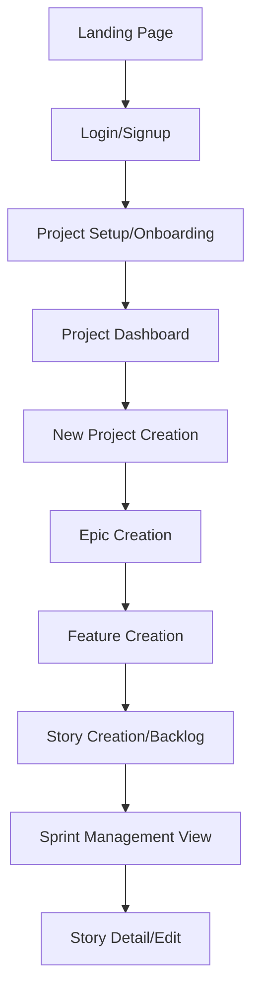

# ScrumHub Webpage UX

This document discusses the user experience of ScrumHub, and how it should be designed to be intuitive and easy to use.

## Design Principles

- Important information should be easy to find and access.
  - The landing page must be familiar.
  - The navigation options must be all visible or easily interpreted.
- The interface should be clean and uncluttered.
  - The design must be modular, with the ability to hide and show different tools and panels.
  - The design and interface must be familiar.
- The application should be responsive and fast.
  - The interface must be mobile adaptive.
  - The interface must be desktop adaptive.
  - The different tools can be draggable and resizable.
- The application should be accessible to all users.
  - Unregistered users can only access documentation.
  - Registered users can access the application with their credentials.
- The application should be customizable to the user's needs.
  - Font size
  - Color scheme
  - Layout
- Key features should be easy to find and access.
  - All buttons must have title and hover properties that describe their purpose
  - All inputs must have title and hover properties that describe their purpose
  - All select must have title and hover properties that describe their purpose
  - All text must have title and hover properties that describe their purpose
  - All images must have title and alternative text
  - All links must have title and hover properties that describe their purpose
  - All icons must have title and hover properties that describe their purpose
  - All tooltips must have title and hover properties that describe their purpose
  - All modals must have title and hover properties that describe their purpose
  - All forms must have title and hover properties that describe their purpose
  - All tables must have title and hover properties that describe their purpose
  - All charts must have title and hover properties that describe their purpose
  - All graphs must have title and hover properties that describe their purpose
  - All diagrams must have title and hover properties that describe their purpose
  - All lists must have title and hover properties that describe their purpose
  - All windows must have title and hover properties that describe their purpose
  - All dialogs must have title and hover properties that describe their purpose
  - All popups must have title and hover properties that describe their purpose
  - All tooltips must have title and hover properties that describe their purpose

## Interface Flow
This document outlines the architecture and user interface flow for **ScrumHub**, a project management tool focused on Agile methodologies (Epics, Features, and Stories).

### 1. Architecture Overview

The application follows a linear progression from acquisition (Landing Page) to authentication, project initialization, and finally into a hierarchical workspace where users define the project scope from the top down (Epic → Feature → Story).

### User Journey Flow

### 2. Detailed View Breakdown

#### A. Landing Page
The entry point of the application designed for conversion.
*   **Elements:**
    *   **Navigation Bar:** Logo, "Home", "Docs", "Blog", "Sign Up" button.
    *   **Hero Section:** Main value proposition headline and sub-headline.
    *   **Primary CTA:** "Get started for free" button.
    *   **AI Preview Component:** A specialized "ScrumHub AI" window showing a mock interaction of AI-assisted backlog generation.

#### B. Login / Signup View
The authentication gate.
*   **Elements:**
    *   **Brand Header:** ScrumHub logo.
    *   **Input Fields:** Email address and Password.
    *   **Actions:** "Login" button and a "Sign up" toggle link.

#### C. Onboarding / Project Initiation
A simplified setup process to get the user into the product quickly.
*   **Elements:**
    *   **Instructional Header:** "Create your first backlog!".
    *   **Input Fields:** Project name, project description.
    *   **Action:** "Create project" button.

#### D. Project Dashboard
The central hub for managing multiple projects.
*   **Elements:**
    *   **Project List:** A list of existing project cards.
    *   **Action Button:** "New Project" button to trigger the creation flow.

#### E. New Project Configuration
A detailed setup view for new workspace environments.
*   **Elements:**
    *   **Project Metadata:** Input fields for Project Name and Description.
    *   **Organizational Settings:** Dropdowns or selectors for "Role" and "Department".
    *   **Action:** "Confirm and continue" button.

#### F. Epic Creation View
The highest level of the Agile hierarchy.
*   **Elements:**
    *   **Header:** Breadcrumb navigation indicating "Epic > Create".
    *   **Inputs:** Epic Name and Epic Description.
    *   **Action:** "Save epic" button.

#### G. Feature Creation View
The secondary level of hierarchy, nested within an Epic.
*   **Elements:**
    *   **Header:** Breadcrumb navigation indicating "Feature > Create".
    *   **Inputs:** Feature Name and Feature Description.
    *   **Metadata:** Priority selector.
    *   **Action:** "Save feature" button.

#### H. Sprint Backlog / Workspace View
The primary operational interface where the team manages work.
*   **Elements:**
    *   **Sidebar Navigation:** Links to Project, Backlog, Sprint, and Reports.
    *   **Top Tabs:** Toggle between "Backlog" and "Sprint" views.
    *   **Data Grid/Table:** A list of items containing columns for:
        *   Priority levels.
        *   Status indicators.
        *   Assignees/Users.
    *   **Action Buttons:** "Create story" and "Start sprint".

#### I. Story Detail / Creation View
The lowest level of hierarchy, the actionable unit of work.
*   **Elements:**
    *   **Input Fields:** Story name, detailed description.
    *   **Technical Fields:** Acceptance criteria, story point estimation.
    *   **Action:** "Save story" button.

### 3. Cross-View Analysis

#### Recurring Elements
*   **Branding:** The "ScrumHub" logo appears consistently in the top-left or center-top of all entry and setup views.
*   **Action Patterns:** Primary actions are consistently placed at the bottom right of modals or forms (e.g., "Save", "Confirm", "Create").
*   **Hierarchical Breadcrumbs:** As the user moves from Epic $\rightarrow$ Feature $\rightarrow$ Story, the header updates to reflect the current nesting level.

#### Inferred Components
Based on the layout, the following UI components can be inferred:
*   **Modals/Overlays:** The "New Project" and "Story Detail" views likely function as modals that overlay the main dashboard or backlog.
*   **Dropdowns:** Used for Priority, Role, and Department selections.
*   **Data Tables:** The Backlog view utilizes a complex table component with sorting and filtering capabilities.
*   **Navigation Sidebar:** A persistent vertical menu used once the user enters the project workspace.